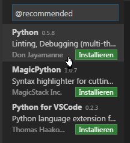

1. Neuste Version von python.org herunterladen

2. Bei Installation "Add Python 3.6 to PATH" auswählen.

3. In der Eingabeaufforderung: pip3 install ipython

4. Neuste Version von https://code.visualstudio.com/ herunterladen

5. In Visual-Studio Code neue Datei erstellen und als test.py speichern.

6. Empfehlungen anzeigen und die Erweiterung von Don Jayamanne installieren.

